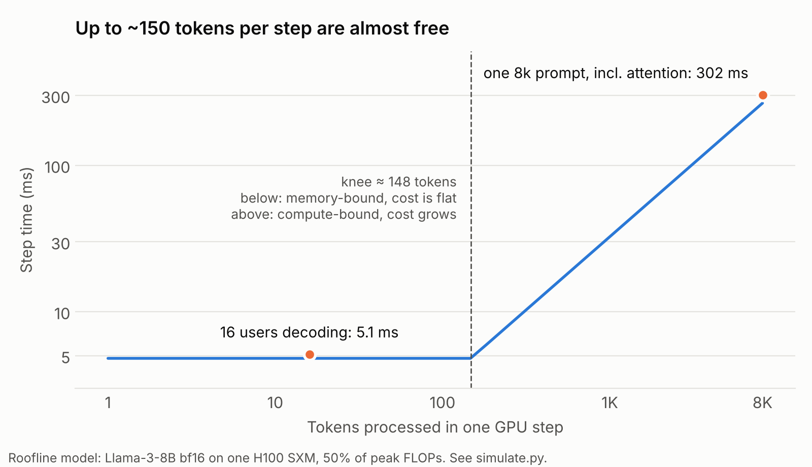
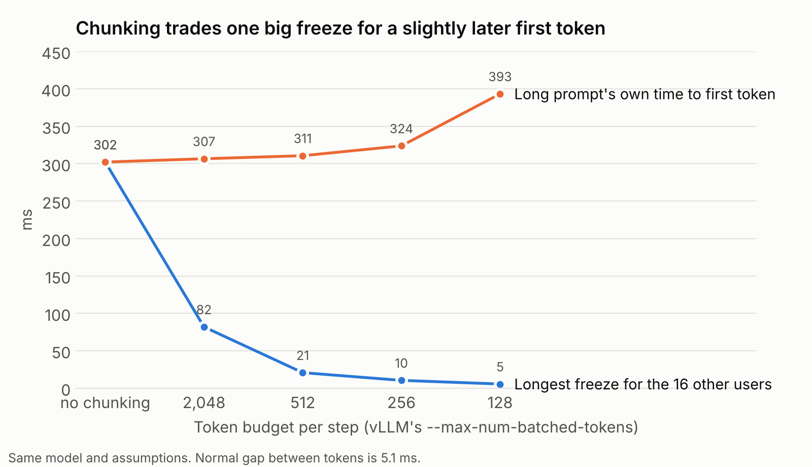

Sixteen people are chatting with a model, each watching tokens stream in every 5 ms. Then someone pastes an 8,000-token document. For the next **300 ms, nobody gets a single token**.

That pause is one of the most common sources of p99 latency in LLM serving, and you can predict its size on a napkin. This post does the maths, then uses a small model to find where the standard fix stops being free.

## Two phases, two bottlenecks

Every request goes through two phases on the GPU:

- **Prefill:** process the whole prompt at once to build its KV cache.
- **Decode:** generate one token at a time, each needing a full pass over the model.

Modern servers run both in the same GPU iterations ("steps"), batching every active user together. The trouble is that the two phases hit completely different limits.

**Decode is limited by memory bandwidth.** Each step has to read every weight from GPU memory. Llama-3-8B in bf16 is about 16 GB; an H100 reads 3.35 TB/s. So a decode step takes at least:

> 16 GB ÷ 3.35 TB/s ≈ **4.8 ms**, whether it's generating for 1 user or 16.

**Prefill is limited by compute.** Each token costs about 2 FLOPs per parameter, so an 8,192-token prompt is:

> 2 × 8B × 8,192 ≈ 1.3 × 10¹⁴ FLOPs, plus ~0.2 × 10¹⁴ for attention

At a realistic 50% of the H100's ~990 TFLOPS, that's **about 300 ms**: the time of roughly 60 decode steps, spent in a single step. Every other user waits for it.

## Where "free" ends

Here's the useful part. A step reads the weights once no matter how many tokens it processes, so extra tokens only cost compute. Each token does 2 FLOPs per parameter while the weights cost 2 bytes per parameter to read, so a step with *T* tokens does roughly *T* FLOPs per byte read. The GPU stays memory-bound until that reaches its compute-to-bandwidth ratio:

> 990 TFLOPS × 50% ÷ 3.35 TB/s ≈ **150 tokens per step**

Below that, adding tokens to a step is nearly free. Above it, every extra token costs time.



Sixteen users decoding is 16 tokens per step, far below the knee. **Most of the GPU's compute is sitting idle during decode.** That idle compute is exactly what the fix uses.

## The fix: chunked prefill

Instead of prefilling the whole prompt in one step, split it into chunks and attach one chunk to each decode step. This is chunked prefill, from the Sarathi-Serve paper ([Agrawal et al., OSDI '24](https://arxiv.org/abs/2403.02310)), which found these stalls could last several seconds in vLLM before it was adopted. In vLLM today, `--max-num-batched-tokens` sets the per-step budget.

I modelled the same scenario (16 users mid-stream, one 8,192-token prompt arriving) at different budgets:



Two things stand out.

**Down to the knee, chunking is close to a free lunch.** At 512 tokens per step, the worst freeze drops from 302 ms to 21 ms, and the long prompt pays only 3%. The total work is the same; it's just spread over 17 steps that use compute decode was wasting anyway.

**Below the knee, the cost appears.** At 128 tokens per step, steps can't get any cheaper than the ~5 ms memory floor, so the prompt now needs 74 of them, and its first token arrives 30% later. You've traded a problem for everyone else for a problem for the person with the long prompt.

And this model is optimistic about small chunks. Real engines pay a fixed overhead every step (scheduling, kernel launches). With an overhead of *c* ms per step, going from 512 to 128 adds 57 more steps, so about 57*c* ms more TTFT. **The sweet spot sits a little above the knee**, which lines up with Sarathi-Serve's finding that prefill throughput saturates around 512 tokens per chunk.

## Seeing it in production

The trap is measuring the wrong thing. Average time-per-output-token hides this completely: one 300 ms freeze spread over a 500-token answer adds less than 1 ms per token. Users don't see averages; they see the stream stop.

What to watch instead:

- **p99 inter-token latency, per token** (older vLLM versions name it `vllm:time_per_output_token_seconds`)
- **p99 prompt length at the same moments**

```promql
# p99 gap between streamed tokens
histogram_quantile(0.99, sum by (le) (rate(vllm:inter_token_latency_seconds_bucket[5m])))

# p99 prompt length
histogram_quantile(0.99, sum by (le) (rate(vllm:request_prompt_tokens_bucket[5m])))
```

The fingerprint is **ITL p99 spiking while ITL p50 stays flat, lined up with spikes in p99 prompt length**. If you see that, check the chunk budget before adding GPUs.

## What the napkin leaves out

This is a roofline model, not a benchmark. It assumes 50% of peak FLOPs, a single GPU, and no per-step overhead; tensor parallelism, quantisation and different hardware all move the knee. The *shape* is what transfers: decode is memory-bound, prefill is compute-bound, and the knee between them tells you how big a chunk can be before it starts to hurt. DistServe takes the idea to its conclusion by running prefill and decode on separate GPUs entirely ([Zhong et al., OSDI '24](https://arxiv.org/abs/2401.09670)).

The model is about 100 lines of Python. `simulate.py` and `plot.py` sit next to this post in the site's repo; change the GPU or the model and rerun.

## Sources

- Agrawal et al., [Taming Throughput-Latency Tradeoff in LLM Inference with Sarathi-Serve](https://arxiv.org/abs/2403.02310), OSDI '24
- Zhong et al., [DistServe: Disaggregating Prefill and Decoding](https://arxiv.org/abs/2401.09670), OSDI '24
- vLLM, [Optimization and Tuning: chunked prefill](https://docs.vllm.ai/en/v0.8.5/performance/optimization.html)
