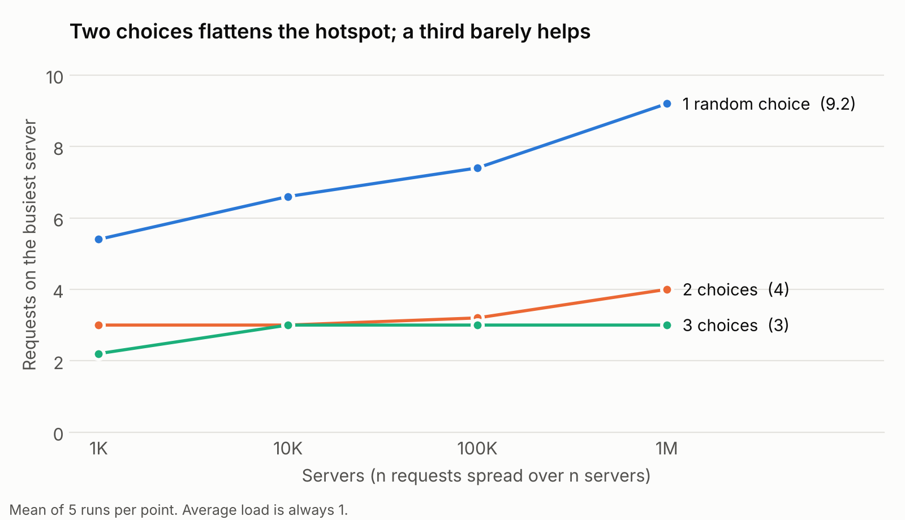
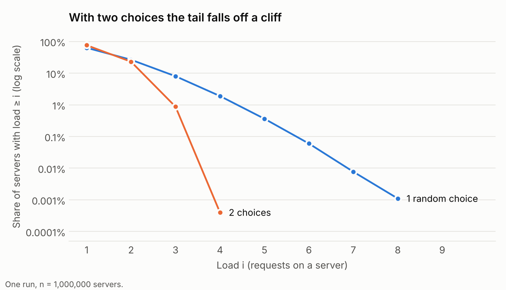

I recently came across a new paper that picks a fight with one of the oldest bits of wisdom in load balancing. The paper is [BalanceRoute](https://arxiv.org/abs/2605.06113) (2026), and the wisdom it's poking at goes like this:

> Pick two servers at random. Send the request to whichever one is less busy.

That's the "power of two choices", and people have been swearing by it since the '90s. It sounds too dumb to matter. It is, in fact, one of the most useful results in distributed systems. Envoy, nginx and HAProxy all ship it, and it's quietly sitting under a lot of LLM request routers right now.

So before getting to what the new kid on the block says, it's worth understanding why the old rule earned its reputation in the first place. In this post: what the result says, why it works, and where it starts to wobble for LLM inference, which is exactly where BalanceRoute comes in. I ran my own simulation, so the numbers are real and not vibes.

## The setup: balls into bins

Let's strip load balancing down to its pyjamas. Say I have **n servers** and **n requests**. On average every server gets exactly one request. Lovely. Fair. Utopian. The question is: **how busy is the busiest server?**

Because that's the one that pages me. My p99, my OOMs, my 3am wake-up calls: they all come from the one unlucky server, never the average one.

Two contenders:

- **One random choice.** Throw each request at a random server and hope.
- **d random choices.** Peek at *d* random servers and send the request to the least loaded one.

I simulated both for fleets from 1,000 to 1,000,000 servers:



With pure random routing, the busiest server gets busier and busier as the fleet grows. At a million servers it's carrying about **9× the average load**, poor thing. With two choices it holds at **4**. A third choice gets me to **3**, which is nice, but nowhere near as dramatic.

The theory agrees:

| Strategy | Max load grows like | Roughly |
|---|---|---|
| 1 random choice | ln n / ln ln n | grows steadily with fleet size |
| d ≥ 2 choices | ln ln n / ln d | effectively flat |

Going from one choice to two is an **exponential** improvement. Going from two to three just divides by a constant (ln 3 / ln 2 ≈ 1.6). Basically all the magic is in the second peek.

## Why it works: the squaring trick

Picture me at a hawker centre at lunch. I don't survey every stall. I glance at two queues and join the shorter one. Congratulations to me: I am a load balancer.

Let **βᵢ** be the share of servers that have at least *i* requests. For a server to climb to *i + 1*, a new request has to land on it. Under two choices, that can only happen if **both** sampled servers already have at least *i*. If either one is emptier, the request goes there instead.

The chance that both are that busy is about **βᵢ²**. So every rung up the load ladder roughly squares a number that's already below 1:

> 50% → 25% → 6% → 0.4% → 0.0015% → …

That's called **doubly exponential** decay, which is a fancy way of saying "falls off a cliff". A few steps in, the share drops below 1/n, which means no server is that busy at all. With one random choice there's no squaring. Each step only shrinks by a roughly constant factor, so the tail just keeps... going.

I could see it right in my simulation. Here's the share of servers at each load level, on a log scale, for a million servers:



The blue line slides down in a straight line: plain old exponential decay, all the way to load 8. The orange line takes one look at load 3 and leaps off a cliff. About 23% of servers have at least 2 requests, 0.9% have at least 3, and only **4 servers out of a million** reach 4. It's even steeper than my "squaring" sketch, because that sketch is an upper-bound intuition, not the exact process. Hand-waving, but honest hand-waving.

## It gets even better under real traffic

Balls-into-bins is a snapshot. Real systems are messier: requests keep arriving and finishing. Michael Mitzenmacher's paper, *The Power of Two Choices in Randomized Load Balancing*, studied exactly this. He called it the **supermarket model** (so my hawker centre analogy is only slightly off-brand): n servers, requests arriving at rate λ per server (λ < 1 is utilisation), each taking a random time to finish.

The result:

- With **random routing**, the share of queues with length ≥ *i* is **λⁱ**.
- With **two choices**, it's **λ^(2ⁱ − 1)**.

Same squaring, now hiding in the exponent. And the gap widens as the system gets busier, which is, of course, exactly when I care. Here's the expected time a request spends in the system, measured in average service times:

| Utilisation λ | Random routing | Two choices |
|---|---|---|
| 50% | 2.0 | 1.27 |
| 90% | 10.0 | 2.61 |
| 99% | 100.0 | 5.43 |

At 99% utilisation, a request under random routing spends about 100 service times in the system on average. Two choices keeps it near 5. That's the difference between "hmm, a bit slow" and "why is everything on fire".

## Why not just pick the least-loaded server?

The obvious follow-up: if peeking at two is good, why not peek at all of them and pick the best one?

Two reasons. The second one is the one that would bite me in production.

1. **Cost.** I'd need fresh load data from every backend, for every request. My network would like a word.
2. **Herding.** Load data is always a little stale. If a bunch of load balancers all see the same server as "least loaded", they all pile onto it at once, like everyone spotting the one empty table at lunch. It melts. Then they all stampede to the next "best" server and melt that one too. Mitzenmacher's follow-up work shows that with even slightly old information, two random choices beats always picking the global minimum.

Randomness isn't a bug here, it's the feature. Different balancers sample different pairs, so their mistakes don't all line up.

## Turns out it's everywhere

- **Envoy**: the `LEAST_REQUEST` policy samples two hosts by default (`choice_count`) and picks the one with fewer active requests. This is under Istio and most service meshes.
- **nginx**: `random two least_conn;`
- **HAProxy**: `balance random(2)`
- **Linkerd, Finagle and gRPC** client-side balancers use variants, often comparing latency instead of request counts.
- **Ray Serve** ships a power-of-two-choices request router as its default for model serving.

And the whole thing fits in a few lines of Go:

```go
// pickTwo returns the less loaded of two randomly sampled backends.
func pickTwo(backends []*Backend) *Backend {
	a := backends[rand.IntN(len(backends))]
	b := backends[rand.IntN(len(backends))]
	if a.InFlight.Load() <= b.InFlight.Load() {
		return a
	}
	return b
}
```

Ten lines. Exponential improvement. Not a bad deal.

## Where it bends: LLM inference

This is where things get fun. The algorithm still works fine. What breaks is the definition of "less busy".

**Request count is a terrible load signal for LLMs.** One request might be a 50-token "hi". Another might be a 30,000-token context that generates for a full minute. Two replicas with 8 in-flight requests each can be doing wildly different amounts of work. It's like judging a queue by headcount when one person is buying a single kopi and the next is ordering lunch for their whole office. From what I've read, better signals are queued and running tokens, KV-cache utilisation, or an estimate of time-to-first-token.

**Cache locality competes with balance.** If a replica already holds a prompt's prefix in its KV cache, sending the request there skips a pile of prefill work. Prefix-aware routers handle this by preferring cache-warm replicas, then falling back to load-based choice when that would create a hotspot. Two choices slots in neatly as that fallback.

## So, is the old rule wrong? Enter BalanceRoute

Quick disclaimer: I'm not a load-balancing researcher. I'm someone who read a paper, got curious and ran a simulation. So these are a learner's notes, not gospel. The paper has the real details.

**The setup it cares about.** Really big models (DeepSeek-V3, in their case) are split across several chips, and that whole setup is copied onto multiple "data-parallel" workers. Here's the catch: every decode step ends with a sync, and nobody moves on until the slowest worker finishes. Think convoy, not race.

**Why that changes everything.** In my simulation, the busiest server was just one unlucky server having a bad day. In a convoy, the busiest worker sets the pace for *everyone*. Remember the blue line in my first chart, where the busiest server got busier as the fleet grew? In a convoy, that gap is time every other worker spends sitting around waiting. The paper makes the same point: add more workers and the gap between the busiest and the average one grows, and so does the idle time.

**Why "less busy of two" isn't enough here.** The paper lists a few reasons. These are the ones that clicked for me:

- **No take-backs.** Once a request lands on a worker, it stays there. Moving it means moving its whole KV cache, which is expensive.
- **Requests keep growing.** In my balls-into-bins sim, every ball weighs the same forever. An LLM request gets heavier with every token it generates, and nobody knows when it will stop. "Less busy right now" doesn't mean "less busy in 30 seconds".
- **Going over the line hurts everyone.** If I push one worker just past the current slowest, I haven't slowed down one worker. I've slowed down the whole convoy.

**What BalanceRoute does instead.** Rather than placing one request at a time, it looks at the waiting requests together and works out each worker's *safe margin*: how much more load it can take before it becomes the new slowest worker. The paper's own one-line summary is lovely: *fill safe margins preferentially, and when overflow is unavoidable, route to the worker where it costs least.* A second version also tries to predict how long requests will keep running.

**The results.** On a 144-chip cluster replaying real traffic, they report about 9–12% more throughput than join-shortest-queue, which is an even stronger baseline than two choices. In their scaling tests the advantage grows with the number of workers, from about 13% with 4 workers to about 35% with 16.

**My take.** The old rule isn't wrong. It's answering a different question. Two choices is brilliant when requests are roughly the same size and each server's queue is its own business. Once every worker has to wait for the slowest one, and requests keep growing after they've been placed, "the less busy of two" stops being enough. The part I find most interesting is that what breaks it is the very thing my simulation was measuring all along: the busiest server. For thirty years that was the number two choices kept nicely small. In a convoy, "nicely small" still isn't small enough, because every bit of it is everyone's problem.

## TL;DR

- Peeking at **two** servers and picking the less loaded one shrinks the worst hotspot **exponentially** compared with random routing.
- A **third** peek helps only a little. The second look is where the magic lives.
- It beats "always pick the global best" in real systems, because stale data causes herding and randomness spreads the mistakes around.
- For LLM serving, I'd keep the algorithm but **pick the load metric carefully**: tokens and KV-cache usage, not request count.
- The old rule isn't wrong, it just assumes servers don't have to wait for each other. In synchronised LLM serving they do, and **BalanceRoute** shows that routing with that in mind gets noticeably more throughput, more so as the cluster grows.

Next up, I'm building a KV-cache-aware router in Go in front of several vLLM instances. The follow-up post will pit round-robin, random and two choices against each other on real inference traffic, with TTFT and throughput numbers. May the best router win.

## Try it out

The simulation and plotting scripts are short Python with NumPy and Matplotlib: [`simulate.py`](simulate.py) and [`plot.py`](plot.py). The million-server run takes about 15 seconds, which is just about enough time to regret not making coffee first.

## References

- M. Mitzenmacher. [The Power of Two Choices in Randomized Load Balancing](https://www.eecs.harvard.edu/~michaelm/postscripts/tpds2001.pdf). *IEEE Transactions on Parallel and Distributed Systems*, 12(10), 2001.
- Y. Azar, A. Broder, A. Karlin, E. Upfal. Balanced Allocations. *SIAM Journal on Computing*, 29(1), 1999. The original balls-into-bins result.
- M. Mitzenmacher, A. Richa, R. Sitaraman. [The Power of Two Random Choices: A Survey of Techniques and Results](https://www.eecs.harvard.edu/~michaelm/postscripts/handbook2001.pdf). 2001.
- M. Mitzenmacher. How Useful Is Old Information? *IEEE Transactions on Parallel and Distributed Systems*, 11(1), 2000.
- [Envoy load balancers: weighted least request](https://www.envoyproxy.io/docs/envoy/latest/intro/arch_overview/upstream/load_balancing/load_balancers)
- [Ray Serve: request routing for LLMs](https://docs.ray.io/en/latest/serve/llm/architecture/routing-policies.html)
- T. Bu, Y. Lyu, Z. Chen, C. Song, H. Liang, T. Gurung, Y. Fan, Y. Ye, Z. Zhou. [Tackling the Data-Parallel Load Balancing Bottleneck in LLM Serving: Practical Online Routing at Scale](https://arxiv.org/abs/2605.06113). arXiv 2605.06113, 2026. The BalanceRoute paper.
