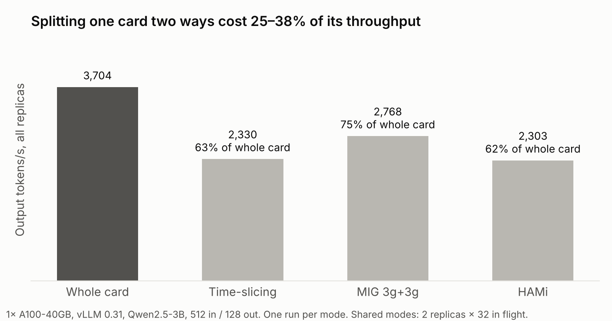
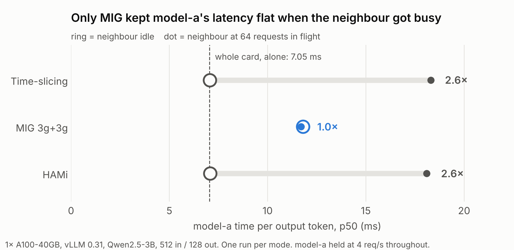

Two small models, one GPU. Sharing the card looks like free money, until one of them gets busy.

I set up exactly that: model-a serving a steady 4 requests per second, model-b sharing the same A100. Then I pushed model-b to 64 requests in flight. With time-slicing, **every token model-a generated took 2.6× longer**, even though model-a's own traffic didn't change at all. With MIG, model-a's latency didn't move.

This post explains how each way of sharing a GPU actually splits the card, what each one costs, why only one of them isolates tenants, and why HAMi's compute limit has no effect on a vLLM server.

## Why I tried this

My day job is running GPU model-serving infrastructure, and the most common waste I see is a small model sitting alone on a whole GPU, using a fraction of its memory and compute. Every GPU-sharing technology promises to fix that: pack several models onto one card and get the idle capacity back.

The waste is easy to miss, because the usual metric hides it. `nvidia-smi`'s **GPU-Util** only measures the share of time *at least one kernel* was running. A kernel on 1 of 108 SMs counts as 100%. A small model on light traffic can show 90% GPU-Util while DCGM's **SM Activity** (`DCGM_FI_PROF_SM_ACTIVE`, the share of SMs actually doing work) is low and most of the memory sits empty. The sharing modes go after different parts of that waste:

- Time-slicing and HAMi fill **idle time**. When one tenant has no requests, the other gets the card. Their kernels never run at the same moment, though.
- MIG gives each small model a **smaller GPU** that it can keep busy.
- MPS, which I didn't test, fills **idle SMs at the same moment**.
- All of them fill **memory**: a 3B model needs about 7 GB of weights, and the rest of a 40 GB card is stranded.

The benefit is capacity, not speed: fewer GPUs for the same set of low-traffic models.

What the docs don't tell you is what sharing costs the tenants. The question that decides whether you can put production traffic on a shared card is simple: **when my neighbour gets busy, does my latency change?** I couldn't find anyone who had measured that on a real LLM serving stack, so I rented a GPU for an afternoon and measured it myself.

## Four ways to share one GPU

A GPU has two things worth sharing: **compute**, the 108 streaming multiprocessors (SMs) that run kernels, and **memory**, 40 GB on this card plus the bandwidth to read it. The four modes differ in how they split each one, and in *who enforces the split*.


**Whole card.** No sharing. NVIDIA's device plugin tells Kubernetes the node has `nvidia.com/gpu: 1`, one pod claims it, and that pod owns every SM and every byte. It's the baseline everything else is measured against.

**Time-slicing.** The device plugin is configured to advertise the one card as two, so Kubernetes happily schedules two pods onto it. That's all it does. On the GPU, the driver runs one process's kernels at a time and switches between them every few milliseconds. Nothing limits memory: each process sees the full 40 GB and can take as much as it wants, which is why I had to split vLLM's `--gpu-memory-utilization` by hand, 0.45 each.

**MIG (Multi-Instance GPU).** On A100- and H100-class cards, the hardware itself can be cut into up to seven isolated instances. Each has its own SMs, its own memory, and its own share of memory bandwidth and cache. To software, each slice looks like a smaller, separate GPU, requested as `nvidia.com/mig-3g.20gb`. The catches: slices come in fixed sizes, changing the layout means draining the card, and two 3g slices leave 24 of the 108 SMs unused.

**HAMi.** An open-source CNCF project that adds fractional GPUs to Kubernetes. Pods ask for a share (`gpumem: 19000`, `gpucores: 50`) and HAMi's scheduler packs them onto cards. Enforcement happens inside each container: HAMi injects a shim library, `libvgpu.so`, between the program and the CUDA driver. It answers "how much memory is there?" with the pod's quota, refuses allocations past it, and pauses kernel launches when the pod goes over its compute share. Underneath, the GPU is still being time-sliced.

That last distinction matters most for what follows. MIG's limits are enforced **by the hardware**, outside the tenant's process. HAMi's are enforced **in software, inside the tenant's own process**, so they only cover the calls the shim intercepts. Time-slicing enforces nothing at all.

## The setup

I used one A100-SXM4-40GB rented from Lambda (about $1.50/hr) running single-node Kubernetes (k3s) and NVIDIA's device plugin. The model server was vLLM 0.31 with Qwen2.5-3B-Instruct. I picked a 3B model so that two copies fit comfortably in half of a 40 GB card. Every mode except the baseline runs two replicas on the same GPU.

| Mode | What each pod asks Kubernetes for |
| --- | --- |
| Whole card | `nvidia.com/gpu: 1` |
| Time-slicing | `nvidia.com/gpu: 1` (the plugin advertises the card twice) |
| MIG, 2× 3g.20gb | `nvidia.com/mig-3g.20gb: 1` |
| HAMi | `nvidia.com/gpu: 1`, `nvidia.com/gpumem: 19000`, `nvidia.com/gpucores: 50` |

I ran three tests with `vllm bench serve`, each request using 512 input and 128 output tokens:

- **Saturation:** 64 requests in flight across the card, to measure total throughput.
- **Quiet:** model-a at 4 req/s with its neighbour idle.
- **Noisy:** the same load on model-a, while model-b runs 64 requests in flight.

## What sharing costs



Both replicas carried the same total load as the single whole-card server, yet time-slicing produced **37% fewer tokens**. There are two reasons:

1. **The processes take turns.** Without MIG or MPS, the GPU runs one process's kernels at a time and switches between them every few milliseconds. Each switch costs time, and the other process's work waits.
2. **Batches get smaller.** One vLLM with 64 requests runs one big batched step. Two vLLMs with 32 each run two half-size steps, and they can't be merged across processes. Decode is memory-bandwidth bound: every step reads all the weights, however many requests are in the batch. Halving the batch means reading the weights twice as often for the same output.

MIG loses less (25%) because its slices really do run in parallel. Its loss is mostly hardware: the A100 has 108 SMs, but MIG profiles never use more than 98, and two 3g slices use only 42 + 42 = **84**.

HAMi landed on top of time-slicing. That turns out to be the interesting part, covered below.

## The noisy neighbour



With time-slicing and its neighbour idle, model-a was as fast as a whole card: **7.06 ms per token vs 7.05**. Time-slicing only takes turns when both processes have work. Once model-b was busy, model-a's tokens took **18.3 ms**, so a 128-token reply went from about 0.9 s to 2.4 s. Model-a can't protect itself: model-b always has work queued when its turn comes.

MIG didn't flinch: **11.8 ms quiet, 11.7 ms noisy**. Each slice has its own SMs, its own memory and its own share of memory bandwidth, so there's nothing for the neighbour to take.

The ring on MIG's row shows its price. Even with the other slice idle, model-a ran at 11.8 ms per token, not 7. A 3g slice gets about half of the card's memory bandwidth, and decode is bandwidth bound, so model-a never gets the whole GPU even when nobody else is using it.

**Time-slicing gives you a fast GPU you might lose. MIG gives you a smaller one you always keep.**

## HAMi's compute cap never saw vLLM's work

HAMi's memory isolation worked well. Inside the pod, `nvidia-smi` reported a 19,000 MiB GPU, because HAMi's shim answers memory queries with the pod's quota rather than the real card's size.

But `gpucores: 50` had no visible effect. HAMi behaved almost exactly like time-slicing: 62% throughput, a 2.6× noisy-neighbour slowdown, and the "50%" aggressor pushed **2,385 tok/s**, the same as the unrestricted aggressor under time-slicing (2,401).

The reason is in how the cap is enforced. HAMi puts `libvgpu.so` in `/etc/ld.so.preload`, so it's loaded first in every process. It defines functions with the same names as the CUDA driver API, checks each call, then forwards it to the real `libcuda.so`. The compute limit lives in the kernel-launch hooks. From HAMi-core (commit `ec5d85a`, trimmed):

```c
// src/cuda/memory.c: kernel launches go through the rate limiter
CUresult cuLaunchKernel(CUfunction f, unsigned int gridDimX, /* ... */) {
    /* ... */
    if (pidfound == 1) {
        rate_limiter(gridDimX * gridDimY * gridDimZ,
                     blockDimX * blockDimY * blockDimZ);
    }
    return CUDA_OVERRIDE_CALL(cuda_library_entry, cuLaunchKernel, /* ... */);
}

// src/cuda/graph.c: graph launches are only logged and forwarded
CUresult cuGraphLaunch(CUgraphExec hGraphExec, CUstream hStream) {
    LOG_DEBUG("cuGraphLaunch");
    return CUDA_OVERRIDE_CALL(cuda_library_entry, cuGraphLaunch, hGraphExec, hStream);
}
```

vLLM captures its decode steps as **CUDA graphs** at startup, then replays each step with a single `cuGraphLaunch`. The hundreds of kernels inside a graph never pass through `cuLaunchKernel`, so the limiter never sees them. This is already reported upstream as [HAMi #1445](https://github.com/Project-HAMi/HAMi/issues/1445). That issue is still open, has no measurements, and doesn't mention vLLM.

So I turned CUDA graphs off with `--enforce-eager` and reran. Model-a ran at **26.2 ms per token, quiet or noisy**, and the aggressor dropped to 1,756 tok/s. That looks like the cap finally working, but I can't claim it. [HAMi-core #350](https://github.com/Project-HAMi/HAMi-core/issues/350) reports that under the default core policy the limiter never engages *at all*, and the source I checked has that ordering. A more boring explanation also fits: a 3B model in eager mode is probably limited by the CPU launching kernels, leaving the GPU idle enough that the two pods never contend. The run that would separate these (eager with `GPU_CORE_UTILIZATION_POLICY=force`, and eager without HAMi) is on my list.

Either way, the practical answer is the same. **With a CUDA-graph server like vLLM, treat HAMi as memory isolation only.** Even if eager mode does buy compute isolation, 26 ms per token is more than twice what MIG costs.

## Two traps that bite before you get to benchmark

**vLLM sizes its KV cache wrong when co-located servers start together.** At startup, vLLM measures memory with device-wide snapshots (`cudaMemGetInfo`) before and after loading weights and running a profiling pass. It counts any growth it didn't allocate itself as its own overhead. Under time-slicing, two pods that started at the same moment counted *each other's* weights, and got **2.2 and 2.74 GiB** of KV cache instead of about **10.6 GiB** each. That's room for about 15 full-length requests per server instead of about 75. Nothing errors. You just get queueing and preemption under load, for the life of the process. Starting them one at a time fixed it, and so would pinning `--kv-cache-memory`. Under MIG and HAMi, pods started together got identical, healthy caches, because each process only sees its own memory.

**Rolling updates deadlock on a full GPU.** When I changed a Deployment's args, Kubernetes started the new pod before stopping the old one, which is the default `RollingUpdate`. HAMi's scheduler answered `CardInsufficientMemory` (38,000 MiB held plus 19,000 needed is more than 40,960), and the new pods sat `Pending` forever. GPU serving Deployments want `strategy: Recreate`, or `maxSurge: 0`.

One setup note: with MIG enabled, the plain device-plugin chart crashed with `Insufficient Permissions`, because reading MIG slices needs device files the default locked-down container can't see. `--set securityContext.privileged=true` fixed it. The GPU Operator handles this for you.

## So which one should you use?

- **The model needs a full card, or latency is critical:** whole card. Sharing only helps when a workload leaves most of the GPU idle.
- **Tenants that need predictable latency on A100/H100-class GPUs:** MIG. Budget for about 25% less throughput and slower tokens per slice.
- **Packing small, trusted internal models, especially on GPUs without MIG (A10, L4):** HAMi, for its memory isolation. Don't rely on `gpucores` with CUDA-graph servers.
- **Dev clusters, notebooks, CI:** time-slicing.
- **Two services running the same model:** one vLLM serving both usually beats two vLLMs sharing a card.

Others have compared these modes. [NVIDIA's consolidation post](https://developer.nvidia.com/blog/maximize-ai-infrastructure-throughput-by-consolidating-underutilized-gpu-workloads/) compares time-slicing and MIG on throughput and mean latency but argues isolation from the architecture rather than measuring it. [GPU-Virt-Bench](https://arxiv.org/abs/2512.22125) benchmarks HAMi-core with synthetic kernels, which wouldn't hit the CUDA-graph path. What I wanted was the tail-latency view on a real serving stack.

## What I'd try next: MPS, DRA and NVIDIA vGPU

Three things I left out are worth knowing about, because each fixes a different weakness above.

**MPS (Multi-Process Service).** Instead of taking turns, MPS lets kernels from several processes run on the GPU at the same time, and it can cap each client's memory and compute. On paper it sits between time-slicing and MIG: concurrent like MIG, flexibly sized like HAMi, and enforced by an NVIDIA daemon rather than a shim inside your process. NVIDIA's device plugin supports it, but [calls the support experimental and doesn't allow it on MIG-enabled GPUs](https://github.com/NVIDIA/k8s-device-plugin). It's the obvious fifth column for this benchmark. The question is whether it gets the throughput back without bringing the noisy neighbour with it.

**DRA (Dynamic Resource Allocation).** Kubernetes is replacing the device plugin's "give me N GPUs" with richer resource claims, enabled by default from Kubernetes 1.34. NVIDIA's [DRA driver](https://dra-driver-nvidia-gpu.sigs.k8s.io/docs/concepts/gpu-allocation/) can share a GPU between claims with time-slicing or MPS. Behind its `DynamicMIG` feature gate, it creates a MIG slice when a pod starts and tears it down when the pod finishes. That would remove MIG's biggest operational pain: re-partitioning nodes by hand and draining them to do it.

**NVIDIA vGPU.** Despite HAMi's library being called `libvgpu.so`, NVIDIA vGPU is a different, licensed product, and it's for **virtual machines**. A host driver splits the card, either time-sliced or MIG-backed, and each VM runs its own guest driver. On Kubernetes it runs through KubeVirt, and [the GPU Operator dedicates each node to either containers or vGPU VMs, not both](https://docs.nvidia.com/datacenter/cloud-native/gpu-operator/latest/gpu-operator-kubevirt.html). It's the right tool when tenants need VM-level isolation, not for packing pods.

## What this doesn't show

Each number comes from a single run, with one 3B model on one A100-40GB. Bigger models, H100s and other servers will move the numbers. I didn't record the HAMi chart version or run an eager whole-card baseline. The *shape* is what I'd expect to transfer: time-slicing and soft limits share everything, so a busy neighbour costs you; MIG shares nothing, so it can't.

The whole thing took about 2.5 hours of GPU time, roughly $5. `results.json`, `plot.py` and `diagram.py` sit next to this post in the site's repo.

## Sources

- HAMi, [`nvidia.com/gpucores` cannot limit CUDA Graph (#1445)](https://github.com/Project-HAMi/HAMi/issues/1445)
- HAMi-core, [SM limit never engages under the default GPU_CORE_UTILIZATION_POLICY (#350)](https://github.com/Project-HAMi/HAMi-core/issues/350)
- HAMi-core source, [Project-HAMi/HAMi-core](https://github.com/Project-HAMi/HAMi-core) (`src/cuda/memory.c`, `src/cuda/graph.c`)
- vLLM forum, [2 vLLM containers on a single GPU](https://discuss.vllm.ai/t/2-vllm-containers-on-a-single-gpu/608)
- NVIDIA, [Maximize AI infrastructure throughput by consolidating underutilized GPU workloads](https://developer.nvidia.com/blog/maximize-ai-infrastructure-throughput-by-consolidating-underutilized-gpu-workloads/)
- NVIDIA, [k8s-device-plugin README: sharing with time-slicing and MPS](https://github.com/NVIDIA/k8s-device-plugin)
- Kubernetes SIGs, [DRA Driver for NVIDIA GPUs: GPU allocation](https://dra-driver-nvidia-gpu.sigs.k8s.io/docs/concepts/gpu-allocation/)
- NVIDIA, [GPU Operator with KubeVirt (vGPU)](https://docs.nvidia.com/datacenter/cloud-native/gpu-operator/latest/gpu-operator-kubevirt.html)
- Jithin VG and Ditto PS, [GPU-Virt-Bench: A Comprehensive Benchmarking Framework](https://arxiv.org/abs/2512.22125)
