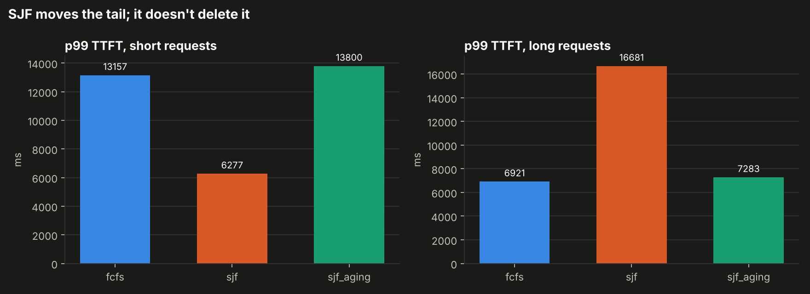
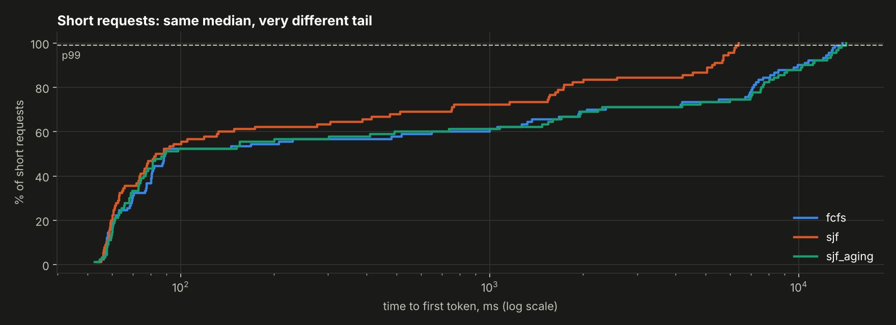

<!--
DRAFT STATUS
- Exp 4 numbers are real (my engine, see "How I measured").
- Exp 1-3 are written from the mechanism + published results, with
  TODO boxes where my own numbers and charts go. Run
  `bash experiments/tail/run_vllm_experiments.sh` on a GPU box, then
  replace each TODO with the numbers it prints.
- Set draft: false when done.
-->

Training is a one-time cost. Inference is a cost you pay on every request, forever. And because a model can't write its fifth token until it has committed to its fourth, every request occupies the GPU for as long as its output is long. Some requests are short, some are very long, and they all share the same hardware. That's where the tail comes from.

I've stared at my fair share of p99 charts, but I realised I couldn't actually explain *why* LLM serving tails look the way they do. So I tried to reproduce each cause on purpose and see what happens. The short version: p99 isn't noise. It comes from a handful of mechanisms, each of which leaves a different fingerprint.

## First: p99 of *what*?

LLM serving has three latencies, and mixing them up is the most common way to misread a dashboard.

- **TTFT (time to first token):** how long until the user sees anything. Mostly queueing plus prefill (processing the prompt).
- **ITL (inter-token latency):** the gap between streamed tokens. Mostly decode, and very sensitive to other requests' prefill.
- **E2E (end-to-end):** dominated by output length, so on its own it tells you little.

One trap: a request's *average* time-per-token hides stalls. A single 2-second freeze spread over 500 tokens looks like +4 ms/token, but the user watched the stream stop for 2 seconds. So everything below measures ITL **per token**, not per request.

## Experiment 4 first: head-of-line blocking in my own engine

I'll start with the experiment I can run end to end, because it's on [the engine I built from scratch](/projects/mini-inference-server/).

The engine does continuous batching: up to 4 requests share the batch, and when one finishes, a waiting request takes its slot. The scheduler has exactly one line that decides *who* gets a free slot. I made that line pluggable and compared three policies:

- **FCFS:** first come, first served (what most servers do by default).
- **SJF:** shortest job first, using each request's output budget as its length. Real servers only have an estimate, so this is the best case.
- **SJF with aging:** SJF, but anything waiting longer than a threshold jumps the queue, to stop long requests from starving.

The workload: 100 requests arriving as a Poisson process at about 55% of measured capacity. 90% are short (20-word prompt, 16 output tokens); 10% are long (150-word prompt, 256 output tokens). **The exact same arrival trace** is replayed for each policy, so the policy is the only thing that changes. Every policy is also checked token-for-token against a single-request reference, so none of them changes what the model outputs.

At 55% load the median looks great: **p50 TTFT for short requests is about 89 ms** under every policy. But under FCFS, **p99 is 13.2 seconds**, roughly 150× the median, and 40% of short requests waited more than a second for their first token.

The reason is slot occupancy. A long request holds one of the four batch slots for 256 decode steps, about 13 seconds on this hardware. When two or three long requests happen to arrive close together (and with Poisson arrivals, sometimes they do), most of the batch is taken and every short request behind them queues. Nothing is broken; the median just never sees it.

SJF helps a lot: short-request p99 drops from 13.2 s to **6.3 s**, and mean TTFT from 2.8 s to 1.2 s. But look at the long requests: their p99 goes from 6.9 s to **16.7 s**. **SJF moves the tail onto someone else; it doesn't delete it.**

Aging surprised me. With a 4-second threshold it behaved almost exactly like FCFS. During a burst, *everyone* waits longer than 4 seconds, so everyone qualifies for the "starving" queue, and that queue is FCFS. An aging threshold set below your typical burst wait just turns the policy back into FCFS. It needs to be tied to your TTFT SLO, not picked arbitrarily.

Two more things the data showed that I didn't go looking for:

- **Inter-token latency in my engine: p50 59 ms, p99 351 ms.** Every time a new request is admitted, its prefill runs in the same loop as everyone else's decode, and every running stream pauses. That's Experiment 2's mechanism, showing up uninvited.
- **My "90% load" run was actually overload.** The queue grew without bound even though batches were only ~67% full. Admitting a request in my engine re-pads and copies the *entire* KV cache, and that time doesn't count as batch occupancy. It's a very concrete reason why vLLM stores the KV cache in fixed-size pages instead of one contiguous tensor (PagedAttention): adding a request shouldn't cost a copy of everyone else's cache.

## Experiment 1: the load cliff

Queueing theory says latency doesn't degrade linearly with load. It's flat, then it bends, then it explodes, and the tail bends first.

> **GPU results coming soon.** The harness for this one is in the repo (`experiments/tail/exp1_load_sweep.py`): a 1 → 24 req/s sweep on vLLM with Qwen2.5-1.5B on one GPU. I'll add the chart and numbers here once it's run.

The practical lesson for capacity planning: plan at the **p99 knee**, not at peak throughput. A server that's "only" at 70% of its maximum tokens/s can already be breaking a TTFT SLO.

## Experiment 2: the long-prompt stall

Prefill (processing a prompt) and decode (generating tokens) share the same GPU iterations. When a long prompt arrives, its prefill competes with every running stream's next token. The Sarathi-Serve paper showed these stalls can last **several seconds** in vLLM before chunked prefill was added ([Agrawal et al., OSDI '24](https://arxiv.org/abs/2403.02310)).

vLLM now always splits prefill into chunks, and `--max-num-batched-tokens` sets how many tokens (decode + prefill) one iteration may process. I run 16 background streams, inject three ~8k-token prompts, and compare a 512-token budget against a 16k one.

> **GPU results coming soon.** Harness: `experiments/tail/exp2_prefill_stall.py`, comparing a 512-token budget against 16,384.

What to expect: a large budget lets the whole prompt prefill in one long iteration, so every stream freezes once. A small budget spreads it out: no big freeze, but the long prompt's own TTFT grows. **It's a tradeoff, not a free win**, and the right setting depends on whether your SLO is on TTFT or ITL. DistServe takes this to its logical end by running prefill and decode on different GPUs, reporting up to 7.4× more requests served within SLO ([Zhong et al., OSDI '24](https://arxiv.org/abs/2401.09670)).

## Experiment 3: running out of KV cache

Every running request keeps its KV cache in GPU memory. When the cache is full, vLLM *preempts* a running request: frees its memory and recomputes it later ([vLLM docs](https://docs.vllm.ai/en/v0.8.5/performance/optimization.html)). The unlucky request pays for its prefill twice and loses its place in line.

> **GPU results coming soon.** Harness: `experiments/tail/exp3_kv_pressure.py`, shrinking the KV cache from 8,192 to 512 blocks.

The dangerous part, operationally: throughput can look fine while this happens. The average request is unaffected, so the only symptom is p99 E2E climbing and a counter most dashboards don't plot.

## What I'd alert on

If I were putting an LLM endpoint behind an SLO tomorrow, this is what I'd watch, in order:

1. **p99 TTFT against an SLO, with burn-rate alerts** (fast and slow windows), the same multi-window approach I used for [my SLO project](/projects/lta-bus-slo-dashboard/). Average latency should be on no alert.
2. **Queue time**, separately from TTFT. When TTFT rises, this says whether it's queueing (add capacity, change admission) or prefill (prompt mix changed).
3. **p99 ITL per token.** Catches prefill stalls that per-request averages hide.
4. **The preemption counter** (`vllm:num_preemptions`). Should be zero in steady state. If it isn't, you're out of KV-cache headroom before you're out of compute.
5. **p99/p50 TTFT ratio.** One number for "is there a structural tail". In my FCFS run it was ~150×.

## What I didn't test

Other real sources of p99 that are out of scope here: CPU overhead (vLLM's own profiling found only 38% of time on the GPU in one setup, [vLLM blog](https://vllm.ai/blog/2024-09-05-perf-update)); cold starts and CUDA-graph capture; and routing (I wrote about the classic load-balancing side separately, in [the power of two choices](/posts/power-of-two-choices/)). Routing that ignores the KV cache is especially costly: llm-d measured p90 TTFT of 0.54 s with cache-aware routing versus 92 s with random routing ([llm-d](https://llm-d.ai/blog/kvcache-wins-you-can-see)). Cache-aware routing is what I'm building next: [a KV-cache-aware router in front of several vLLM instances](/projects/kv-cache-aware-router/).

## How I measured

- **Engine (Exp 4):** my [mini inference server](/projects/mini-inference-server/), Phase 4 continuous-batching scheduler, max batch size 4, greedy decoding, output length fixed (EOS ignored). Model: GPT-2-small architecture (124M parameters, 12 layers, 768 hidden) on CPU, ~50 ms per decode step at batch 4. <!-- TODO: if you rerun on your Mac with real gpt2 weights, update this line and the numbers above. The run in this draft used randomly initialised weights with GPT-2's exact architecture on a 2-vCPU cloud machine; latency depends on shapes, not weight values, so the scheduling behaviour is the same. -->
- **Arrivals:** open-loop Poisson. A closed-loop benchmark (N clients that wait for a reply before sending again) slows down when the server does, which hides exactly the queueing tail being measured.
- **Exp 1-3:** vLLM, Qwen2.5-1.5B-Instruct, one GPU (results pending).
- Code, raw per-request JSON, and the scripts that draw every chart are in the repo under `experiments/tail/`.
