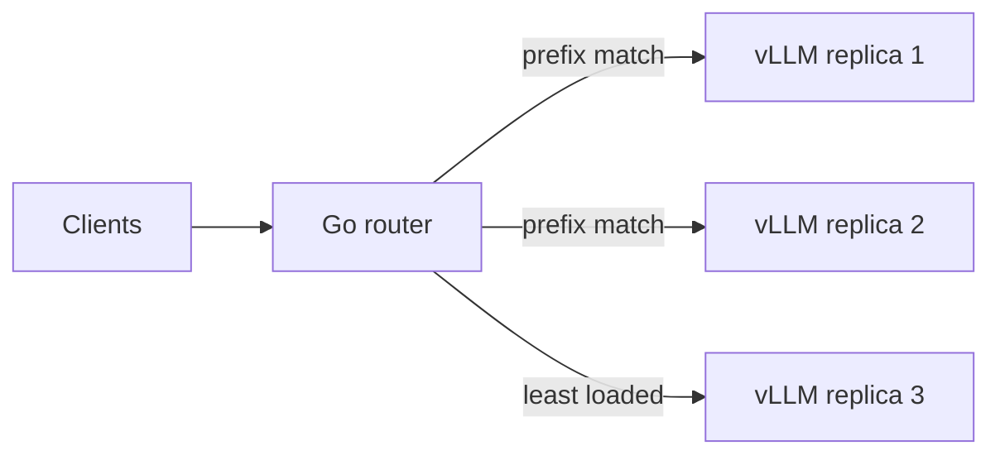

## Problem

Round-robin load balancing ignores the KV cache. When requests sharing a long prefix (a system prompt, a conversation history) land on different replicas, each one recomputes the same prefill.

## What I built

<!-- Routing policy, how prefix affinity is tracked, how it balances cache hits against load. -->

## Results

<!-- Cache hit rate, time-to-first-token and p99 latency compared with round-robin under the same load. -->

## What I learned
