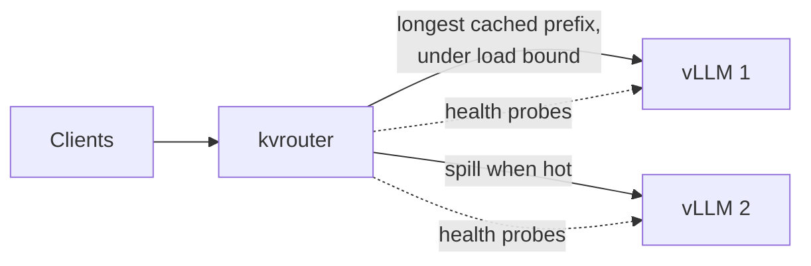

## Problem

When several vLLM servers sit behind a load balancer, each one keeps a KV cache of prompts it has recently processed. A request whose prompt is already cached skips most of its prefill and starts streaming almost immediately. A request that lands on the wrong server pays for the whole prompt again.

Ordinary load balancers don't know any of this. Round-robin makes every server try to cache every tenant's system prompt, so the caches thrash. Least-loaded is worse than it sounds: it scatters the turns of one conversation across servers, so each turn starts cold.

The obvious fix, "always send it to the server with the cache", has its own failure mode: one popular tenant pins one server to 100% while the others idle. So the real question is how to balance cache affinity against load.

## What I built

A reverse proxy in Go, standard library only, that sits in front of any OpenAI-compatible server.

- **Prefix hashing without a tokenizer.** The router hashes each prompt in small blocks, each hash chained to the one before it, the same way vLLM keys its cache. Two prompts share a cached prefix exactly when they share a chain of hashes.
- **Affinity with a load cap.** It sends each request to the server holding the longest cached prefix, unless that server is already over a load bound (consistent hashing with bounded loads, Mirrokni et al., 2018). Then it spills to the next-best server, which warms up a second copy of the hot prompt.
- **Small details that mattered.** A minimum match length, so the chat-template header every prompt shares doesn't count as a hit, and rendezvous hashing for brand-new prompts, so a conversation's later turns land where its first one did.
- **Production-style failure handling.** Retries happen only before the first token (never mid-stream, which would duplicate output), with active and passive health checks and a Prometheus `/metrics` endpoint. Every response carries headers explaining why the router chose that server.
- **A benchmark harness** that runs six routing policies against the same multi-tenant, multi-turn chat workload, including the weighted-scoring approach used by llm-d and the Kubernetes Gateway API Inference Extension.

**Stack:** Go, vLLM, Docker, Prometheus, Python for analysis, 2× NVIDIA H100.

## Results

On two H100s serving Qwen2.5-7B with vLLM 0.31.0, I ran 100 tenants with 3k-token system prompts: about 1.5× what one server can cache. Goodput counts requests per second that met the SLO (first token within 500 ms, under 25 ms per output token).

At 256 concurrent conversations:

- **kvrouter served 142 req/s within SLO**, against 25 for round-robin (5.6×) and 6 for least-loaded.
- **Its cache hit rate was 93%**, against 67% and 63%, and median time to first token was **196 ms** against 1.5 s.
- **On a skewed workload, where one tenant sends half the traffic, the load cap is what saves it.** Pure affinity got only 46 req/s within SLO; with the cap it got 147 (3.2×).

Across 115,200 requests there were zero errors, and the cache hit rate the benchmark measured matched vLLM's own counters exactly.

## What I learned

- **"Least loaded" can be the worst choice.** It looks balanced, but by splitting conversations across servers it had the lowest cache hit rate of all, and it collapsed at high load.
- **Affinity needs a ceiling.** Without the load cap, a single popular tenant overloads one GPU. With it, the hot prompt simply gets cached in two places.
- **At light load, routing barely matters.** At 48 concurrent, every policy met the SLO for about 99% of requests. H100 prefill is fast, so cache misses only hurt once the GPUs are busy.
- **The router's view of the cache is a guess.** In a stress test with deliberately small caches, a fifth to a third of the requests it expected to hit were already evicted. The next step is to build the index from vLLM's own KV-cache events instead of guessing.
