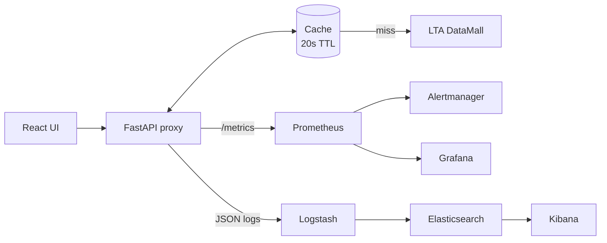

## Problem

I wanted to practise being on call for something, so I picked a thing I genuinely check every morning: whether my bus is coming. Singapore's LTA DataMall has a free Bus Arrival API, so I put a proxy in front of it.

That raised two real questions. What does "reliable" mean for a service that depends on an API I don't control? And how do I get paged for real problems without getting paged for every little blip?

## What I built

A FastAPI proxy over the LTA Bus Arrival API, wrapped in the full observability kit a production service would get. Current user base: an estimated one (1) person.

- **A cache with a stale fallback.** Responses are cached for 20 seconds. If LTA goes down, the proxy serves the last known timings and says so in an `X-Served-From: stale-cache` header, instead of returning an error.
- **Three SLOs:** availability of at least 99.5% (about 3.6 hours of error budget a month), P95 latency under 500 ms, and bus data no older than 30 seconds.
- **Multi-window burn-rate alerts.** Burning budget at 14× the sustainable rate over an hour pages me; 3× over six hours opens a ticket. There are separate alerts for high latency and stale data.
- **A runbook for every alert**, each with the same four parts: symptom, diagnosis, mitigation and escalation.
- **Structured JSON logs** flowing through Logstash into Elasticsearch and Kibana, auto-tagged for errors, slow requests and stale-cache serves.
- **An SLA that takes itself far too seriously**, complete with a severity matrix and service credits of one (1) sincere apology.

**Where it runs:** the whole 8-container stack starts with one `docker compose up` locally, it's deployed on a single AWS EC2 instance, and there's a fully scripted path to AWS EKS using Terraform, Helm and GitHub Actions.

**Stack:** Python, FastAPI, React, Prometheus, Grafana, Alertmanager, Elasticsearch, Logstash, Kibana, Docker Compose, AWS EC2 and EKS, and Terraform.

## What I learned

- **Choosing what to measure is the hard part.** When LTA goes down, my proxy still happily returns 200 OK from the stale cache, so a plain availability SLI would say everything is fine. Tracking how old the data is, per bus stop, is what actually catches it.
- **Burn rates beat fixed thresholds.** A single error-rate threshold either pages on every blip or sleeps through a slow bleed. Two windows give each problem the right level of urgency.
- **Stale data usually beats an error**, as long as you can see it happening. The header and a stale-serve counter make the fallback visible without digging through logs.
- **Small boxes force real decisions.** The ELK stack alone wants about 1.5 GB of RAM, which is more than a t3.micro has. So there are two setups: the full stack for investigating, and a lean one for running cheaply.
