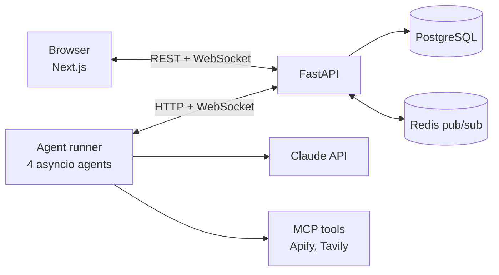

## Problem

Most agent demos hide everything interesting behind a chat box. I wanted to actually *see* my agents work: who's busy, who owns which task, and when work changes hands, without digging through logs.

So I built an office and filled it with penguins.

## What I built

Four autonomous agents run around the clock, each one a penguin with its own desk:

| Penguin | What it does | How often |
|---|---|---|
| Job Hunter | Searches LinkedIn, saves listings, judges fit, and passes good leads on | Every 3 min |
| Tech Scout | Runs budgeted web searches and writes a daily tech briefing | Daily |
| Leetcode Coach | Posts a daily practice problem and coaches me without spoiling the answer | Daily |
| Portfolio Penguin | Tracks job leads, drafts cover-letter outlines and sums up the pipeline | Every 5 min |

When one agent hands work to another, a messenger pigeon flies across the room. The pigeon isn't just decoration: it only takes off once the task has actually been saved.

Under the hood:

- **Each agent is its own `asyncio` task** with a priority loop: me chatting beats inter-agent tasks, which beat its own background work. So the office stays responsive even when everyone's busy.
- **Real tools over MCP.** Job Hunter calls an Apify LinkedIn scraper and Tech Scout calls Tavily search. Daily budgets are stored per agent, so a restart can't accidentally overspend.
- **A typed live feed.** Every update is a typed WebSocket message, mirrored between Pydantic and TypeScript, and Redis pub/sub fans events out across API replicas.
- **Bonus penguin:** a Claude Code hook turns my own coding session into a penguin. Editing makes it code, running commands makes it debug, and searching makes it research.

**Stack:** Next.js, React, TypeScript, Zustand, FastAPI, SQLAlchemy, PostgreSQL, Redis, the Claude API, MCP, Docker Compose and GitHub Actions.

The full source is on [GitHub](https://github.com/sparkling-snail/penguinhq).

## What I learned

- **Save first, animate second.** It's easy to build a demo where the animation works even though nothing was recorded. So every hand-off is written to the database first, and the pigeon carries that same task ID.
- **Paid tools should fail gracefully.** If an API key is missing, only that agent's ability switches off, not the whole office.

## What's next

Being honest about the rough edges:

- The queue between agents still lives in memory, so a hand-off in flight doesn't survive a restart (the database record does). Next up is a proper worker with retries.
- End-to-end tracing, so I can follow one request from my message to the agent's decision to the tool call.
- Real per-user login before the live version can go public.

## Credits

The office renderer and Claude Code hook bridge are adapted from [Claude-Office](https://github.com/W17ant/Claude-Office) by W17ANT (MIT licence). PenguinHQ is a non-commercial fan project and is not affiliated with Disney or Club Penguin.
