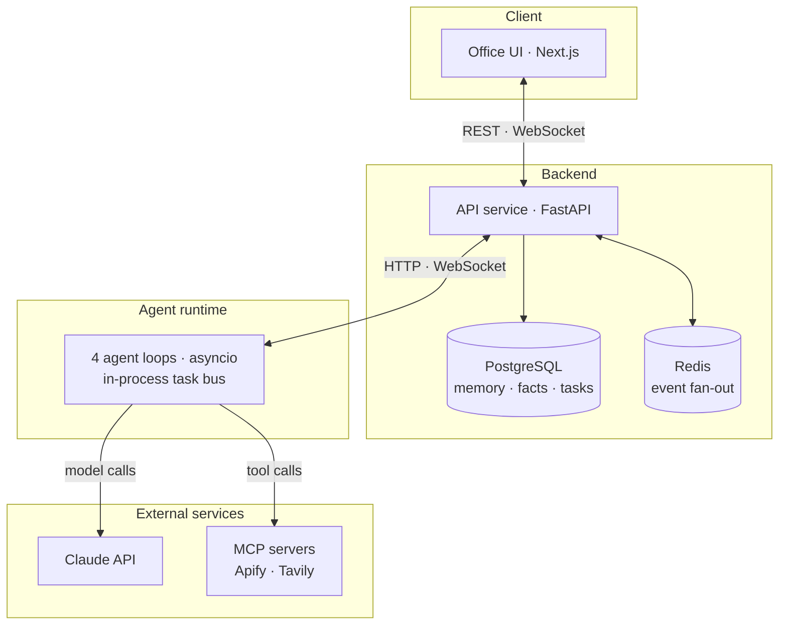

## Problem

Most agent demos hide everything interesting behind a chat box. You can't see which agent is busy, what it's waiting on, or when work changes hands. To debug that, you're left reading logs.

I wanted agents I could actually watch, running on their own and doing useful work for me. That meant facing the questions every agent system runs into sooner or later: how agents take turns, what they remember, how they call tools safely, and how to stop one from quietly burning money.

So I built an office and filled it with penguins.

## What I built

Four agents run around the clock. Each has its own desk, its own tools and its own memory:

| Penguin | Tools | What it does |
|---|---|---|
| Job Hunter | Apify LinkedIn scraper, over MCP | Searches LinkedIn, rates each listing 1–10 against my preferences, and hands good leads on |
| Tech Scout | Tavily search, over MCP | Writes a daily tech briefing on a fixed search budget |
| Leetcode Coach | Claude | Sets a daily problem, reviews my attempts, and gives hints without spoiling the answer |
| Portfolio Penguin | Claude | Takes job leads and drafts cover-letter outlines |

When one agent hands work to another, a messenger pigeon flies across the room. The pigeon only takes off after the task has been saved to the database, so what you see on screen is always real.

### The agent design

- **One loop per agent, with a strict priority order.** Each agent is its own `asyncio` task. A message from me beats a task from another agent, which beats the agent's own scheduled work, so the office answers straight away even when everyone is busy. If one agent crashes, it backs off and retries without taking the others down.
- **Real tools over MCP.** Job Hunter and Tech Scout connect to hosted MCP servers, list the tools available, and choose one by name and input schema. Tech Scout is restricted to basic search and never uses crawl or deep research.
- **Memory in two layers.** Each agent keeps its last 16 turns in PostgreSQL. After each reply, a second, cheaper model call pulls out facts like *target role* or *location*. It can only use **a fixed list of keys per agent**, and it is told to skip anything I didn't actually say. Those facts go into the system prompt, so the agent still knows them long after the conversation has scrolled away.
- **Spend limits live in code, not in the prompt.** Job Hunter has a daily listing quota and Tech Scout a daily search budget. Both are counted in the database, so a restart can't reset them, and the agent tells me when it has paused for the day.
- **Decisions the model shouldn't make alone.** The model rates each job, but code decides what happens next: 6 or above goes to Portfolio Penguin, and 8 or above goes as high priority.

**Bonus penguin:** a Claude Code hook turns my own coding session into a penguin. Editing makes it code, running commands makes it debug, and searching makes it research.

**Stack:** Python, FastAPI, SQLAlchemy, PostgreSQL, Redis, the Claude API, MCP, Next.js, TypeScript, Zustand, Docker Compose and GitHub Actions.

## Inside the office

Job Hunter returning real LinkedIn listings. Each search is counted against its daily quota before it runs.

Tech Scout combining a few budgeted searches into one briefing.

The practice desk. My attempt is saved, and the coach replies with a hint rather than the answer.

## What I learned

- **Parse model output like untrusted input.** Job Hunter asks the model for an "N/10" rating. My first parser took the first digit it found, so "10/10, excellent fit" was read as **1**, and the best leads were the ones silently thrown away. Nothing errored and nothing looked wrong in the office. A tiny unit test found it. Since then, every piece of model output that drives a decision gets a parser with its own tests.
- **Make the memory schema boring.** A model left to name its own facts can call the same fact by different names each time, and then nothing can ever be updated. A fixed list of keys per agent made memory reliable and testable.
- **Save first, animate second.** It's easy to build an animation that works even though nothing was recorded. Every hand-off is written to the database first, and the pigeon carries that same task ID.
- **Paid tools should fail on their own.** If an API key is missing or a budget runs out, only that agent's ability switches off, and it says so in chat instead of failing silently.

## What's next

Being honest about the rough edges:

- **Evals.** Fit scoring, fact extraction and the coach's no-spoiler rule are all checked by hand today. Next is a small labelled set for each, run in CI, so a prompt or model change can't quietly make them worse.
- **Hand-offs that survive restarts.** The task record is saved, but delivery between agents still goes through an in-memory queue. A restart can strand a hand-off in flight. The fix is to deliver from the database with leases and retries.
- **Tracing**, so I can follow one request from my message, through the agent's decision, to the tool call and its cost.

## Credits

The office renderer and Claude Code hook bridge are adapted from [Claude-Office](https://github.com/W17ant/Claude-Office) by W17ANT (MIT licence). PenguinHQ is a non-commercial fan project and is not affiliated with Disney or Club Penguin.
